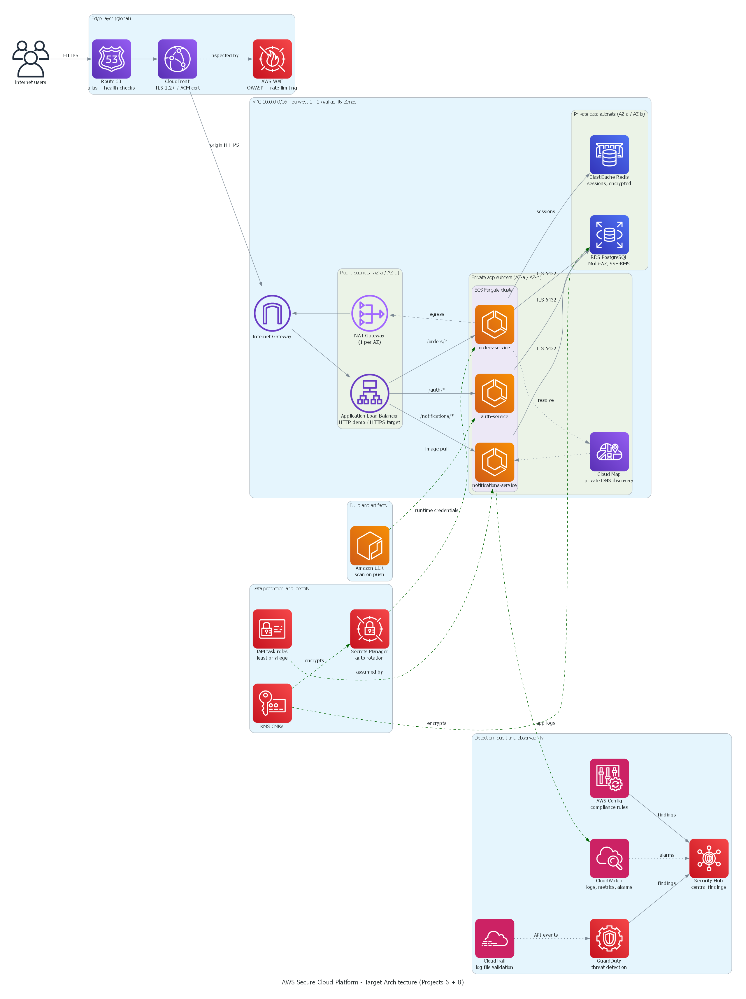

# Secure Cloud-Native Microservices Platform

> AWS Solutions Architect – Associate (SAA-C03) graduation project — Manara.
> Combines **Project 6 (Containerized Microservices with ECS Fargate)** and **Project 8 (Secure Multi-Tier Architecture with GuardDuty, KMS & Security Hub)** into a single, defense-in-depth, container-based platform.

**Author:** Youssef Zaoujal

## What this project demonstrates

A three-service Node.js platform (Auth, Orders, Notifications) built to run identically in two modes:

1. **Local mode (implemented, tested, CI-verified):** Docker Compose, isolated internal network, health checks, container vulnerability scanning.
2. **AWS target mode (fully designed, not deployed to avoid cloud cost):** ECS Fargate, Cloud Map, RDS, ElastiCache, ALB + WAF + CloudFront + Route 53, and a full security control plane — KMS, Secrets Manager, GuardDuty, Security Hub, AWS Config, CloudTrail, IAM least-privilege roles and Service Control Policies.

The full documentation, diagrams, IAM/KMS policy examples, Well-Architected mapping, cost estimate and architecture decision records live in [`secure-cloud-platform/`](secure-cloud-platform/).

## Quick links

| | |
|---|---|
| Full README & quick start | [secure-cloud-platform/README.md](secure-cloud-platform/README.md) |
| Architecture diagrams | [secure-cloud-platform/architecture/](secure-cloud-platform/architecture/) |
| Security design (Project 8) | [secure-cloud-platform/docs/security.md](secure-cloud-platform/docs/security.md) |
| IAM / KMS / Config policy examples | [secure-cloud-platform/security/](secure-cloud-platform/security/) |
| Well-Architected Framework mapping | [secure-cloud-platform/docs/well-architected-mapping.md](secure-cloud-platform/docs/well-architected-mapping.md) |
| Estimated AWS monthly cost | [secure-cloud-platform/docs/cost-estimate.md](secure-cloud-platform/docs/cost-estimate.md) |
| Architecture Decision Records | [secure-cloud-platform/docs/adr/](secure-cloud-platform/docs/adr/) |

## Why local Docker Compose instead of a live AWS deployment?

Deploying and leaving ECS Fargate, RDS, NAT Gateways, WAF and GuardDuty running for the review period costs real money for no learning benefit beyond what a well-documented, reproducible target architecture already proves. The [ADR 0002](secure-cloud-platform/docs/adr/0002-local-implementation-vs-live-deployment.md) explains this trade-off and what would be required to actually deploy it (also documented, not run).

## License

MIT — see [LICENSE](LICENSE).
